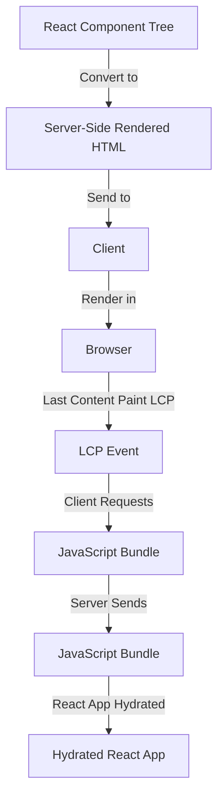

# SSR-from-scratch

An experiment of creating React server components from scratch


```mermaid
graph TD
    A[React Component Tree] -->|Convert to| B[Server-Side Rendered HTML]
    B -->|Send to| C[Client]
    C -->|Render in| D[Browser]
    D -->|Last Content Paint LCP | E[LCP Event]
    E -->|Client Requests| F[JavaScript Bundle]
    F -->|Server Sends| G[JavaScript Bundle]
    G -->|React App Hydrated| H[Hydrated React App]
```

## Run

```bash
npm install
npm start
```
